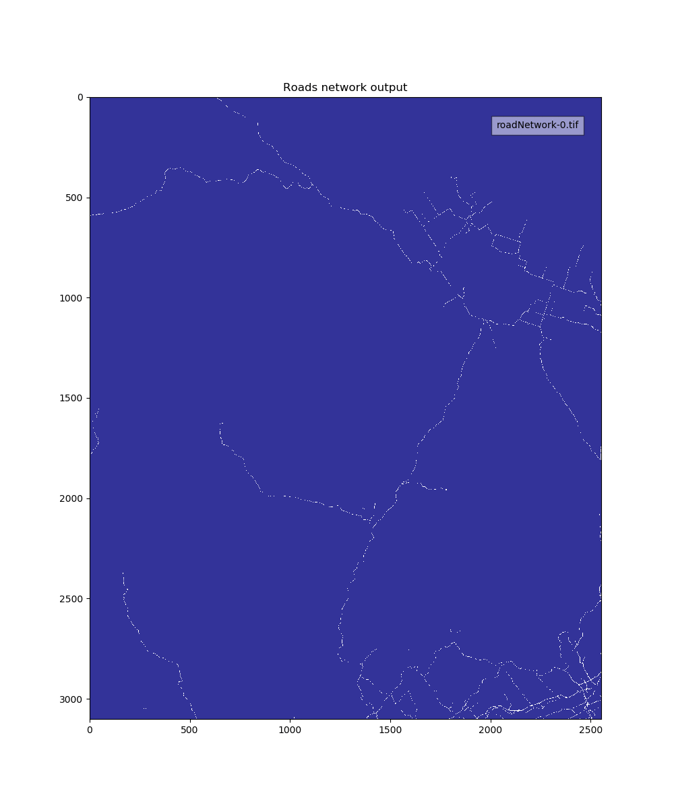
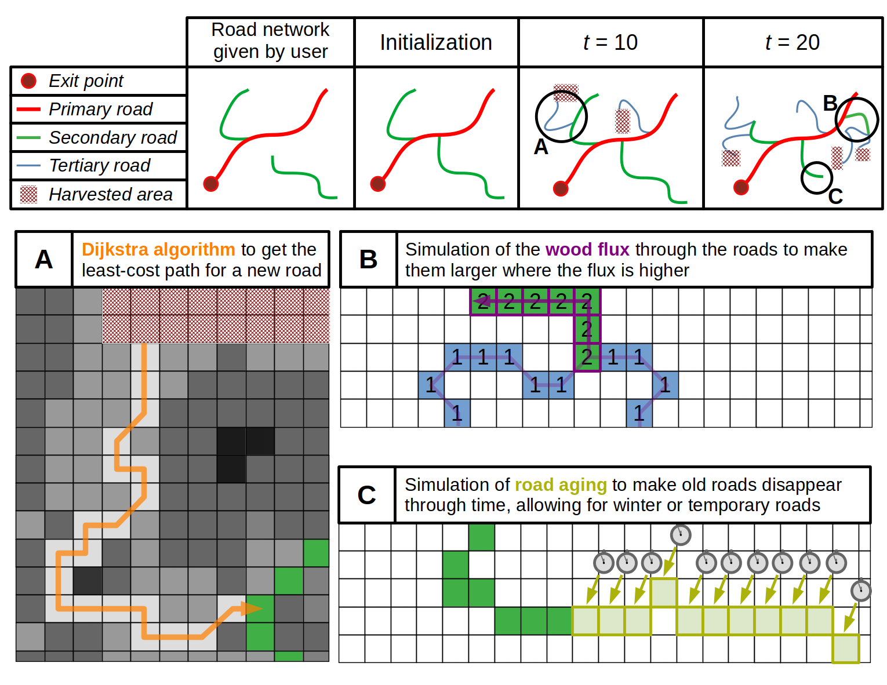
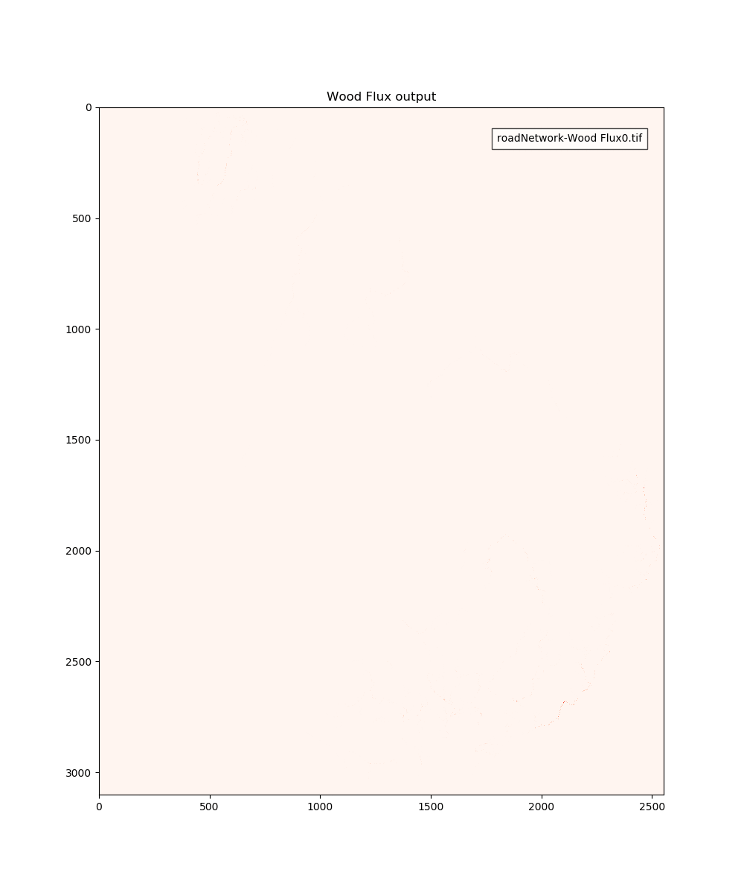

# A LANDIS-II extension to simulate forest roads in a landscape

CAUTION : This is a work in progress, and some functions might be currently missing or not optimized.

This extension is made for use with the LANDIS-II landscape model, available on http://www.landis-ii.org/ .
It functions in pair with a harvest extension to simulate how the forest road network of the landscape dynamically changes with wood harvesting.

## Features
- Detection of an installed harvest extension (without it, the road network will not change) [**Completed**]
- Reading of a raster containing the initial road network [**Completed**]
- Completion of the initial road network to avoid isolated roads that lead to nowhere [**Completed**]
- At each timestep, the extension gets all of the recently harvest sites, and construct a road to them unless they are close enough for to an existing road for skipping wood to them [**Completed**]
- The building of new roads is made by an algorithm that finds the least-cost path according to elevation, lakes/rivers, vegetation, soils and distance [**Completed**]
- Each road is assigned a type (primary, secondary, tertiary, winter roads...) according to the flux of wood that flows through them [**Completed**]
- The cost of construction or upgrading of the roads is saved in a log [**Completed**]
- Roads can have a lifetime, and have to be maintained with money to keep being used. [**Completed**]
- An output raster is created at each timestep to see the evolution of the road network in the landscape [**Completed**]
- Loops are created in the network according to simple rules, in order to increase the realism of the fragmentation of the landscape [**Completed**]
- If a repeated prescription is used where the site harvested recently will be visitied again (e.g. shelterwood or uneven-aged management), the module will choose the cheapest option between constructing a long-lasting road or a cheaper road that will have to be re-constructed when accessing the site at the next harvest rotation. [**Completed**]
- Roads can be abandonned or destroyed according to several criterias.[*Still to be done*]

## Screenshots

Road network            |  Wood Flux
:-------------------------------------------------------:|:----------------------------------------------------:
 |

 
## Download
 
A pre-release can be downloaded [here](https://github.com/Klemet/LANDIS-II-Forest-Roads-Extension/releases/download/0.96/LANDIS-II-V7.Forest.Road.Simulation.Extension.0.96-setup.exe ).

## Use

Before use, we recommand reading the user guide available for download [here](https://github.com/Klemet/LANDIS-II-Forest-Roads-Extension/blob/master/LANDIS-II%20Forest%20Roads%20Simulation%20v0.9%20User%20Guide.pdf). WARNING : Remember that some of the features indicated in the user guide might still be currently missing, and that many are yet to come.

To currently use the extension, you must have a parameter files fed to the extension via the main .txt file of the LANDIS-II scenario.
An example of parameter file is available in the "Example files" folder.

You also have to feed the extension a raster containing the initial road network; an example of raster can also be found in the "Example files" folder.
 
## Author

Clément Hardy

PhD Student at the Université du Québec à Montréal

Mail : clem.hardy@outlook.fr

## Acknowledgments

This work would not be possible without the incredible project that is LANDIS-II, and without the care and passion that the LANDIS-II fondation had to make the project as participative and accessible as it is. I thank them all tremendously.

